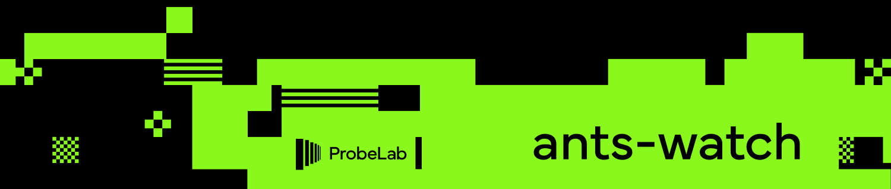

# Ants Watch

[](https://probelab.io)


`ants watch` is a DHT client monitoring tool. It is able to log the activity of all nodes in a DHT network by
carefully placing _ants_ in the DHT keyspace. For nodes to utilize the DHT they need to perform routing table maintenance tasks. 
These tasks consist of sending requests to several other nodes close to oneself in the DHT keyspace. `ants watch` ensures
that at least one of these requests will **always** hit one of the deployed ants. When a request hits an ant, we record information about the requesting peer like agent version,
supported protocols, IP addresses, and more.

**Supported networks** (selected via `--project`/`--network`):

* [Celestia](https://celestia.org/) — `celestia/mainnet`, `celestia/arabica-11`, `celestia/mocha-4`
* [Avail](https://availproject.org/) — `avail/mainnet-lc`
* Can be extended to support other networks using the [libp2p DHT](https://github.com/libp2p/specs/tree/master/kad-dht) by adding an entry to `bootstrappers.go`.


## Table of Contents

- [Ants Watch](#ants-watch)
	- [Table of Contents](#table-of-contents)
	- [Methodology](#methodology)
	- [Setup](#setup)
	- [Configuration](#configuration)
	- [Usage](#usage)
		- [Queen](#queen)
		- [Health](#health)
	- [Ants key generation](#ants-key-generation)
	- [License](#license)


## Methodology

* An `ant` is a lightweight [libp2p DHT node](https://github.com/libp2p/go-libp2p-kad-dht), participating in the DHT network, and logging incoming requests.
* `ants` participate in the DHT network as DHT server nodes. `ants` need to be dialable by other nodes in the network. Hence, `ants-watch` must run on a public IP address either with port forwarding properly configured (including local and gateway firewalls) or UPnP enabled.
* The tool releases `ants` (i.e., spawns new `ant` nodes) at targeted locations in the keyspace in order to _occupy_ and _watch_ the full keyspace.
* The tool's logic is based on the fact that peer routing requests are distributed to `k` closest nodes in the keyspace and routing table updates by DHT client (and server) nodes need to find the `k` closest DHT server peers to themselves. Therefore, placing approximately 1 `ant` node every `k` DHT server nodes can capture all DHT client nodes over time.
* The routing table update process varies across implementations, but is by default set to 10 mins in the go-libp2p implementation. This means that `ants` will record the existence of DHT client nodes approximately every 10 mins (or whatever the routing table update interval is).
* Depending on the network size, the number of `ants` as well as their location in the keyspace is adjusted automatically.
* Network size and peers distribution is obtained by querying an external [Nebula database](https://github.com/dennis-tra/nebula).
* All `ants` run from within the same process, sharing the same DHT records.
* The `ant queen` is responsible for spawning, adjusting the number and monitoring the ants as well as gathering their logs and persisting them to a central database.
* `ants-watch` does not operate like a crawler, where after one run the number of DHT client nodes is captured. `ants-watch` logs all received DHT requests and therefore, it must run continuously to provide the number of DHT client nodes over time.


## Setup

### Prerequisites

Migrations are embedded in the binary and applied automatically by the queen on
startup, so no external tooling is required.

You can start a Clickhouse database with:

```shell
just local-clickhouse

# or

docker run --name ants-clickhouse --rm -p 9000:9000 -p 8123:8123 -e CLICKHOUSE_DB=ants_local -e CLICKHOUSE_USER=ants_local -e CLICKHOUSE_DEFAULT_ACCESS_MANAGEMENT=1 -e CLICKHOUSE_PASSWORD=password clickhouse/clickhouse-server
```

This will start a Clickhouse server with the container name `ants-clickhouse` that's accessible on the non-SSL native port `9000`. The relevant database parameters are:

* host: `localhost`
* port: `9000`
* username: `ants_local`
* password: `password`
* database: `ants_local`
* secure: `false`

The queen applies the embedded migration files from `./db/migrations` on startup, stripping the `Replicated` merge tree prefixes in-code.
The `Replicated` merge tree table engines only work with a clustered clickhouse deployment (e.g., clickhouse cloud). When
running locally, you will only have a single clickhouse instance, so applying `Replicated` migrations would otherwise fail.
Set `ANTS_CLICKHOUSE_MIGRATIONS_REPLICATED_TABLE_ENGINES=true` on a clustered deployment to keep the `Replicated` engines.

### Configuration

The following environment variables should be set for ants-watch:

```sh
# project + network select the DHT and are the pair requested from nebula
ANTS_PROJECT=celestia
ANTS_NETWORK=mainnet

ANTS_CLICKHOUSE_HOST=localhost
ANTS_CLICKHOUSE_PORT=9000
ANTS_CLICKHOUSE_DATABASE=ants_local
ANTS_CLICKHOUSE_USER=ants_local
ANTS_CLICKHOUSE_PASSWORD=password
ANTS_CLICKHOUSE_SSL=false

# the queen reaches the nebula service over gRPC
ANTS_NEBULA_SERVICE_HOST=localhost
ANTS_NEBULA_SERVICE_PORT=8282
```

## Usage

Once the database is set up and migrations are applied, you can start the honeypot.

`ants-watch` needs to be dialable by other nodes in the network. Hence, it must run on a public IP address either with port forwarding properly configured (including local and gateway firewalls) or UPnP enabled.

### Queen

To start the ants queen, you can run the following command:

```sh
go run ./cmd/ants queen --project celestia --network mainnet --upnp # for UPnP
# or
go run ./cmd/ants queen --project celestia --network mainnet --first.port=<port> --num.ports=<count> # for port forwarding
```

Use `--project`/`--network` (default `celestia`/`mainnet`) to select the network. The queen fails to start if the pair has no configured bootstrap peers (see `bootstrappers.go`).

When UPnP is disabled, ports from `firstPort` to `firstPort + nPorts - 1` must be forwarded to the machine running `ants-watch`. `ants-watch` will be able to spawn at most `nPorts` distinct `ants`.

### Health

You can run a health check on the honeypot by running the following command:

```sh
go run ./cmd/ants health
```

## Ants Key Generation

The queen ant periodically queries the [Nebula](https://github.com/dennis-tra/nebula) database to retrieve the list of connected DHT servers. Kademlia identifiers of these peers are then inserted into a [binary trie](https://github.com/guillaumemichel/py-binary-trie/). Using this binary trie, the queen defines keyspace zones of at most `bucket_size - 1` peers. One ant must be present in each of these zones in order to capture all DHT requests reaching the `bucket_size` closest peers to the target key.

Kademlia identifiers are derived from a libp2p peer id, which itself is derived from a cryptographic key pair. Hence generating a key matching a specific zone of the binary trie isn't trivial and requires bruteforce. All keys generated during the bruteforce are persisted on disk, because they may be useful in the future. When an ant isn't needed anymore, its key is marked as available for reuse. This also allows reusing the same peer ids for the ants across multiple runs of the honeypot.

## Related Efforts

- [hydra-booster](https://github.com/libp2p/hydra-booster) - A DHT Indexer node & Peer Router

## Maintainers

- [@guillaumemichel](https://github.com/guillaumemichel)
- [@kasteph](https://github.com/kasteph)
- [@dennis-tra](https://github.com/dennis-tra).

## Contributing

Feel free to dive in! [Open an issue](https://github.com/probe-lab/ants-watch/issues/new) or submit PRs.

Standard Readme follows the [Contributor Covenant](http://contributor-covenant.org/version/1/3/0/) Code of Conduct.

## License

[MIT](LICENSE) © ProbeLab
